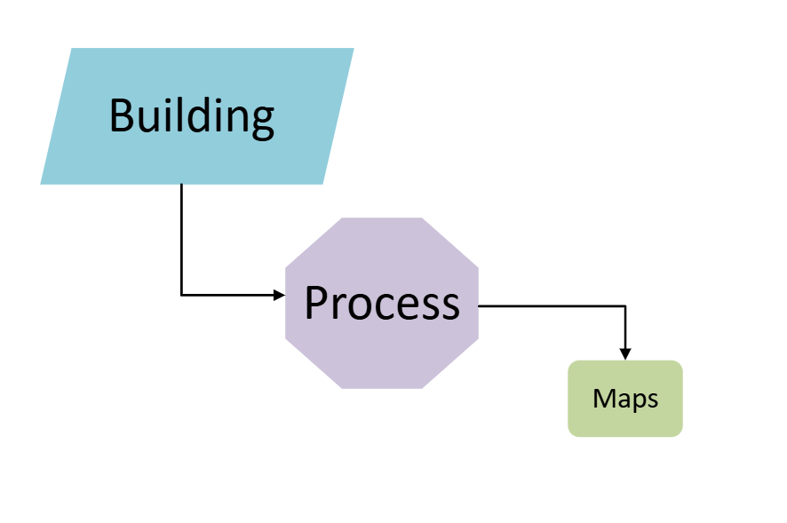
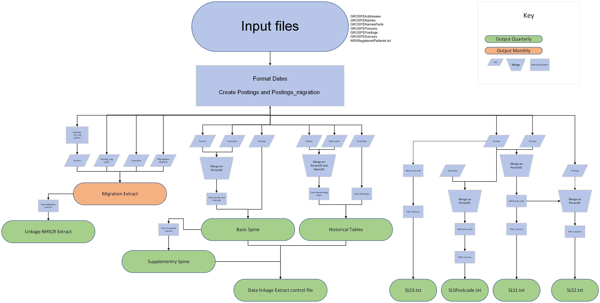
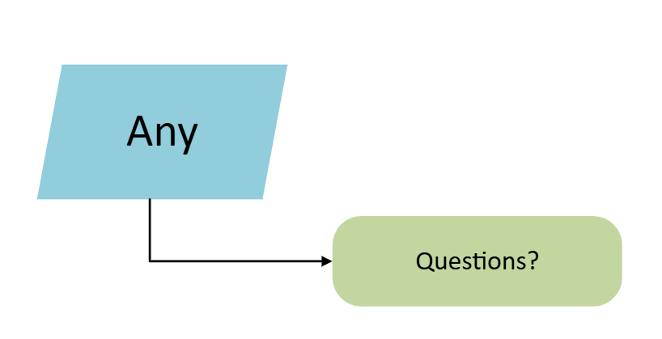
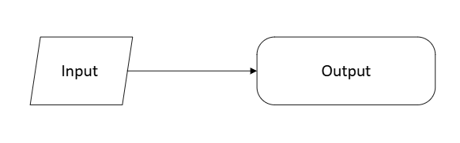

## {fig-alt="A flow chart reading building process maps" fig-align="center"}

## What is a process map?

A process map is a method for documenting and visualising the steps required to move from the beginning to the end of a process.

They can vary in their level of detail; however, it is helpful to include the following key elements:

-   Input Data
-   Manual steps
-   Code or prompts
-   Outputs

## Why create a process map?

-   Develop a shared understanding within your team of what the process involves
-   Explain the process to others (new team member, colleagues)
-   Spot opportunities to improve the process
-   Make it easier to develop the process in a non linear way

## Top tips for creating a process map

-   Start simple
-   Use symbols consistently
-   Keep the scope manageable
-   Keep your process map with your code
-   You don’t need to understand every line of your code
-   Don’t worry about using specialist software

## Building a process map

Using NHSCR - Migration Extract as an example

-   Visio is available as part of the Microsoft 365 suite

{fig-alt="A process map diagram depicting a key in the upper left hand, and the process of creating the NHSCR extract on the right hand side."}

## Building a process map

Completed maps can be used to scope and plan RAP projects.

{fig-alt="Like the above image however several boxes are highlighted to indicate areas of redundancy within the initial process map"}

## A further example

{fig-alt="The full scale NHSCR process map to highlight the complexity that some maps can develop into"}

## {fig-alt="Flow charts asking Any questions" fig-align="center"}

##Where to find Visio

Through the SCOTS Microsoft365 (or M365) account we have access to the online version of Visio, Microsoft's flowchart building software.

It can easily be located via the NRS home page by clicking the 9 dots at the top left hand side of the screen. From there you can use the search bar and type Visio or you can click `More Apps` scrolling to the bottom of the page to find the Visio icon.

Starting a new template document will give you a standard palette of shapes to get starting in building your process map.

## Building a process map

-   Process maps can use existing code or be used to plan projects from the outset.

First identify fixed constants

{fig-alt="A simple flowchart with an input and output" fig-align="center" width="441"}

Ask what changes are required to convert input into desired output. Add each major change to the map as an element. You can build on the detail, using different shapes, colours or expanding the map.
