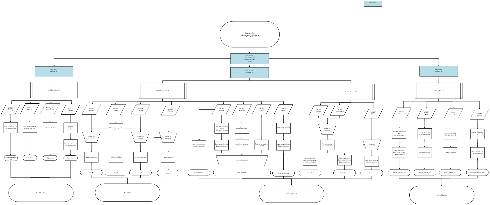

An organisational KPI is to

::: callout-note
"Increase the proportion of statistical processes that are automated,
transparent and reproducible using open-source coding and RAP principles."
:::

To measure this, the RAP Development Team have come up with the RAP Assessment
Tool, where all the statistical processes that NRS teams produce can be measured
as to whether they meet RAP good practice or not.

This guidance aims to provide further guidance to the guidance provided in the
RAP Assessment Tool, by using the NHSCR RAP pipeline as an example of all of the
criteria.

The NHSCR code can be found here - link to GitHub.

## Does a process map exist?

Process maps provide a clear, visual overview of how data flows from inputs
through processing and analysis to final outputs.

The NRS RAP Book contains detailed [instructions on how to make process
maps](https://scotgovanalysis.github.io/nrs-rap-book/guidance/process-mapping.html).

The NHSCR process map is as follows:

{fig-alt="Process map illustrating the NHSCR RAP pipeline."
width="90%"}

## Is all code well-commented?

Code comments should be used to provide context to your code. Commenting your
code will help others understand the code you’ve written and why it’s been
written in a particular way.

A commented line of R code starts with a single \# followed by a space.

``` r
# Test that only nametypes of zero are recorded
assert_that(unique(surhisttab$nametype) == "0")
```

This example comment from the NHSCR RAP pipeline explains to the reader who may
not be familiar with that code syntax, what the purpose of the code does in
plain English.

## Is your code in a self-contained and well-structured repository?

A repository is another word for the folder where all the files for your project
are stored. A self-contained repository means all files required for the project
are stored in the same place.

Your repository should have a sensible, organised, clear structure. Sub-folders
may be created for code, data, lookups, data, outputs, functions (pick and
choose which are relevant to your project).

Code scripts should be numbered if they should be run in a certain order. Data
and output files should be date-stamped.

It should be clear to somebody new to the project where to look for certain
files.

The NHSCR repository structure is as follows:

``` text
|-- README.md
|-- R_NHSCR.Rproj
|-- NHSCR_run_pipeline.R
|-- .gitignore
|-- code/
|   -- Historical_extract.R
|   -- NHSCR_Annual.R
|   -- NHSCR_Monthly.R
|   -- NHSCR_Quarterly.R
|-- functions/
|   -- Compare_outputs_functions.R
|   -- Dateformatting_functions.R
|   -- Make_comparisons.R
|   -- Read_in_data.R
|   -- Test_functions.R
|   -- Validation_test_helpers.R
|-- lookup/
|   -- Basic_spine_colnames.R
|   -- input_colnames.R
|   -- migration_colnames.R
|   -- SLS_colnames.R
|   -- Yearly_colnames.R
|-- output_metadata/
|   -- metadata.Rmd
|-- validation/
|   -- Compare_outputs.R
|   -- Validation_tests.R
```

## Does your code repository contain a README file?

A README file should be stored within your repository and contain a brief
overview of the project including instructions for running the code and contact
details for the team who owns the project.

The README can be in any text file format, however it is recommended to use a
markdown file format (.md) as this will be automatically displayed in your
repository.

LINK TO README FILE

## Are dependencies documented?

To ensure reproducibility of your code it is important that package dependencies
are documented in your RAP project code repository. Record names and the version
of each external R or Python package used.

In the NHSCR code packages and their versions used are documented in the README
file.

``` r
## Other Attached Packages

| Package    | Version |
|------------|---------|
| renv       | 1.2.3   |
| rmarkdown  | 2.25    |
| data.table | 1.18.4  |
| here       | 1.0.2   |
| glue       | 1.6.2   |
| assertthat | 0.2.1   |
| lubridate  | 1.9.3   |
| forcats    | 1.0.0   |
| stringr    | 1.6.0   |
| dplyr      | 1.2.1   |
| purrr      | 1.2.2   |
| readr      | 2.1.4   |
| tidyr      | 1.3.1   |
| tibble     | 3.2.1   |
| ggplot2    | 3.5.0   |
| tidyverse  | 2.0.0   |
| knitr      | 1.45    |
| callr      | 3.7.6   |
| janitor    | 2.2.1   |
```

## Does your code follow a style guide?

A style guide describes best practices for writing clean, consistent and
maintainable code. For example:

-   Naming conventions for variables, functions, files.

-   Formatting rules to make your code easier to read.

-   Standard ways document and comment code.

-   Best practices for writing efficient code, reducing errors.

For R, we recommend following the [tidyverse style
guide](https://style.tidyverse.org/).

## Does your code use configurable parameters?

A data analysis process is more secure and reusable if certain values are stored
separately from the analysis code. For example:

-   Directory paths for reading or writing files such as csv files or
    spreadsheets

-   Database connection details

-   A URL and API key required to access an external API to read data

-   Parameter values to be set before running the code, for example a reference
    year

Writing such values directly into code is known as hard-coding and it is best
avoided where possible. It is better practice to manage these type of variables
as configurable parameters.

For sensitive variables such as API keys consider using the keyring package for
R or Python to store these securely. An alternative is to create an environment
variable.

For less sensitive parameters a config file or script can be used to set values
such as file paths or analytical variables used throughout a process.

More information is available in the [Configuration chapter of the Duck
Book](https://best-practice-and-impact.github.io/qa-of-code-guidance/configuration.html).

``` r
# Input the full path to input files location. Must be in ""
in_dirpath <- "/mnt/dl_acp79_read/Archive/Downloads/Downloads \2026/Download - Mar 26"

# Input the desired path to the out folder location.
# It is good practice that this is a separate folder to the input files to
# avoid accidental overwriting. Must be in ""
out_dir <- "/mnt/dl_acp79_modify/SAS to R - Testing/Testing_R_code/"

# Input the migration month. This is for naming output files. It should follow
# the convention MonthYear i.e "Jan26"
mig_month <- "Mar26"

# Input determines wither to run Monthly or Quarterly extracts
# Set as "Monthly" or "M" to run just the monthly extract
# Set as "Quarterly" or "Q" to create both monthly and quarterly extracts
# Set as "Annual" or "A" to create the complete extract
mode <- "M"
```

This example from the NHSCR RAP pipeline sets the configurable parameters all in
one place in the NHSCR_run_pipeline.R code, and explains clearly to the reader
how to set the parameters.

## Is code used for all data processing steps?

Data processing includes steps to extract data from its storage location,
cleaning, restructuring and linking with other data sources.

Using code for these steps can help to document all changes that are made to a
dataset and minimise the risk of human error when carrying out these steps
manually.

The R for Data Science book has guidance on using code for [importing data, data
transformation and tidying, including recommendations of which R packages to
use](https://best-practice-and-impact.github.io/qa-of-code-guidance/configuration.html).

The NHSCR RAP pipeline uses code for all data processing steps and the script
NHSCR_run_pipeline.R to run whichever of the four extracts are required.

``` r
#run the selected mode
if (mode == "monthly" || mode == "m") {
  print("Running Monthly pipeline")
  source("code/NHSCR_Monthly.R")
  print("Monthly extracts completed")
} else if (mode == "quarterly" || mode == "q") {
  print("Running Monthly pipeline")
  source("code/NHSCR_Monthly.R")
  print("Monthly extracts completed")
  print("Running quarterly pipeline")
  source("code/NHSCR_Quarterly.R")
  source("code/Historical_extract.R")
  print("Quarterly extracts completed")
} else if (mode == "annual" || mode == "a"){
  print("Running Monthly pipeline")
  source("code/NHSCR_Monthly.R")
  print("Monthly extracts completed")
  print("Running quarterly pipeline")
  source("code/NHSCR_Quarterly.R")
  source("code/Historical_extract.R")
  print("Quarterly extracts completed")
  source("code/SCR_Annual.R")
  print("Annual extracts completed")
} else {
  print("No mode has been selected")
}
```

## Are all data inputs clearly documented and version controlled where possible?

All datasets, lookups and reference files used within the process should be
clearly documented, including their source and purpose. Where possible, changes
to these inputs should be tracked through version control to improve
transparency, reproducibility and auditability.

In the NHSCR RAP pipeline, this information is all contained in the README.md
and version control is used to track changes.

## Are analytical outputs generated automatically from the source data and code?

Open source programming languages such as R allow all components of a published
output to be created with code. This includes all charts, tables and commentary.
R Markdown or Quarto might be used for html reports or Shiny for dashboards.
Some benefits of this approach:

-   It reduces error in copying and pasting items into a document.

-   It saves time regenerating the report for updated source data as the process
    has been automated.

-   It can ensure accessible, well formatted and professional looking outputs.

For the NHSCR RAP pipeline, code has been used to produce all output tables and
markdown has been used to produce the README.

## Is Git used for version control?

Git is a version control software for tracking changes to files. Using Git means
you don’t need to save multiple copies of the same file to retain older
versions. Git keeps a record of what change was made, when the change was made,
why the change was made, and who made the change.

The NRS RAP Book contains further guidance on [using Git in
R](https://scotgovanalysis.github.io/nrs-rap-book/training/Git-in-R.html).

## Is code stored in a shared organisational repository?

Making your code open means it is available to anybody who would like to view
it. Publishing your code can:

-   Increase trust in your analysis

-   Encourage collaboration

-   Improve quality

-   Help others benefit from your work.

LINK TO NHSCR CODE ON GITHUB

## Does code contain functions where appropriate?

Replacing repetitive blocks of code with functions can make your code easier to
read and make it easier for you or others to maintain and update the code in
future. This process is often known as code refactoring.

For example, in the NHSCR code, we created a custom function for date columns
which converts NA (i.e. missing) to blank:

``` r
# general date formatting for columns which converts NA - blank
fmt_date <- function(x) {
  ifelse(is.na(x), "",
         format(x, "%Y%m%d"))
}
```

## Is data quality assurance built into the code?

Code can be used to automate data quality assurance. Checking assumptions about
data early in your analysis pipeline ensures that any issues can be spotted and
dealt with quickly.

The NHSCR pipeline contains

## Is automated testing built into the code?

Automated checks can be used throughout the analytical pipeline to verify data
quality, calculations and outputs. Building validation and testing into the code
helps identify issues earlier, reduces manual quality assurance effort, and
improves reproducibility.

The NHSCR testing scripts are contained in the "validation" folder.

## Can the process be executed end-to-end with minimal manual intervention?

The ultimate aim is for all steps in an analytical pipeline to be executed from
a single script. This negates the need to open individual code scripts and run
them one-by-one in a certain order.

The NHSCR pipeline can be run dynamically from changing the configurable
parameters in the script NHSCR_run_pipeline.R.

## Has code been reviewed by somebody [inside]{.underline} the immediate team?

Having your code reviewed by somebody else in your team can assure you that:

-   your code works as expected

-   your analysis is reproducible

-   your documentation provides sufficient information for somebody else to know
    how to run your code

Code review can be a one-off exercise but ideally somebody else should review
your code any time a change is made. If you are already using GitHub or Azure
DevOps, this can be facilitated by using Pull Requests.

## Has your code been reviewed by somebody [outside]{.underline} the immediate team?

It is beneficial for someone external to the team to review the RAP code:

-   It ensures reproducibility of the RAP as a standalone process, not relying
    on undocumented internal knowledge.

-   People more distant from the process can provide useful feedback and
    perspective.

Contact the RAP team for code reviews - rap.development\@nrscotland.gov.uk
