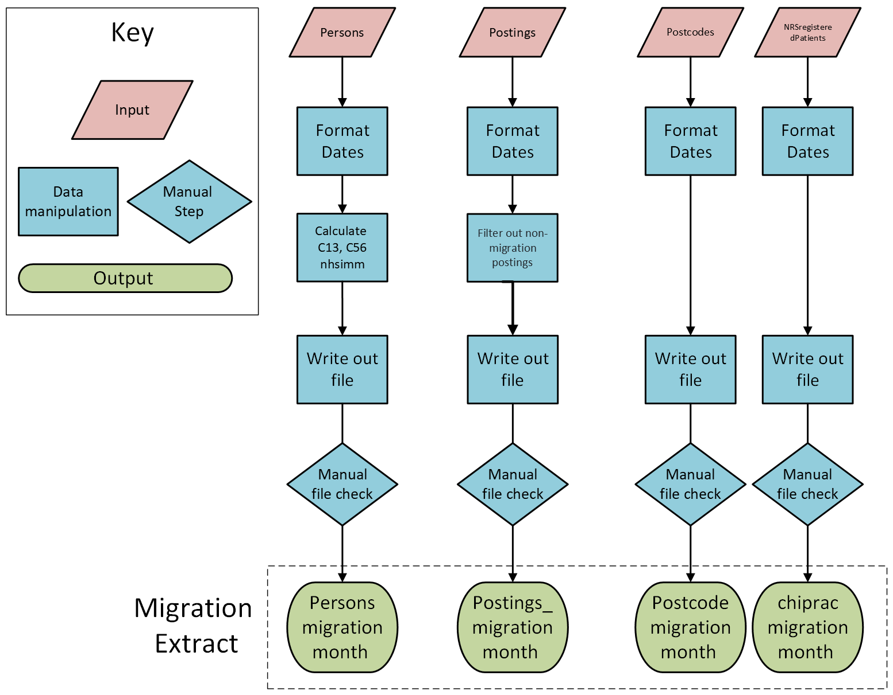

This document introduces process mapping and explains why it is a useful tool
for documenting and improving analytical processes. Process maps provide a
clear, visual overview of how data flows from inputs through processing and
analysis to final outputs. They support transparency, shared understanding, and
more efficient ways of working. They can also support work within existing SAS
projects, help teams track and document their analytical pipeline, and provide a
clear foundation when transitioning to open‑source tools.

## What is a process map?

A process map is a method for documenting and visualising the steps required to
move from the beginning to the end of a process. In the context of NRS
statistics, a process may relate to the production of publications, management
information, data tables, or any other analytical work that is carried out on a
recurring basis.

Process maps can vary in their level of detail; however, it is generally helpful
to include the following key elements:

-   **Input data:** These may come from a database, a flat file, or be manually
    defined within code.

-   **Manual steps:** These can include tasks such as copying and pasting data
    between files, renaming or moving files, or carrying out manual quality
    assurance checks.

-   **Code or programs:** These may consist of SAS programs, R scripts, or other
    automated processing tools. In some cases, it may also be useful to include
    details of the main tasks the code carries out.

-   **Outputs:** These can include data files, charts saved as image files,
    formatted Excel spreadsheets, publication reports, or dashboards.

## Why create a process map?

A process map is an invaluable piece of documentation for any analytical
process. It can help you to:

-   **Develop a shared understanding** within your team of what the process
    involves. This is particularly useful for managers or others who are not
    closely involved in the day-to-day technical delivery.

-   **Explain the process to others**, such as a new team member or a colleague
    from the RAP Development team who may be supporting redevelopment work.

-   **Spot opportunities to improve the process,** such as areas where steps
    could be simplified, reordered, or combined.

-   **Make it easier to develop the process in a non‑linear way,** for example
    by showing where improving outputs or visualisations first could be more
    useful than starting at the beginning.

Even if a process has already undergone redevelopment, creating a process map
remains valuable, particularly for building shared understanding and supporting
knowledge transfer. In addition, further opportunities for improvement may still
be uncovered.

## Top tips for creating a process map

-   **Start simple.** Begin with a high-level view of the process. If it becomes
    clear that additional detail is needed, this can always be added later.

-   **Don’t worry about using specialist software.** Simple text boxes and
    arrows in PowerPoint or Word are often sufficient. Tools like Microsoft
    Visio can also work well, but they are not essential.

-   **Use symbols consistently.** Use different symbols to distinguish between
    data, code, and manual steps.

-   **Have a clear key or legend to explain what each symbol represents.** The
    specific symbols you choose are less important than using them consistently.

-   **Keep the scope manageable.** Avoid trying to capture multiple processes,
    or an overly large process, in a single map. A good rule of thumb is to
    create one map per publication or equivalent analytical product. If a map
    becomes too large or complex, consider splitting it into separate maps, for
    example, one for data processing and another for producing outputs.

-   **Keep your process map with your code where possible.** It makes it easier
    to find later. This also follows RAP principles by keeping documentation
    alongside the code base, rather than in a separate location. If it is not
    possible to store the process map with the code, it should be kept alongside
    the rest of the project documentation.

-   **You don’t need to understand every line of your code** to produce a useful
    process map. It is about capturing the flow, not the detail.

## Example process map

The example process map below is based on NHSCR, which is a SAS process run on
monthly and quarterly basis. It reads in multiple datasets, applies a series of
transformations, and produces a set of output data files. This example focuses
on illustrating a section of that flow.

{fig-alt="Process map illustrating part of an analytical workflow, with four largely identical process flows and two flows containing an extra data manipulation step, highlighting where the process diverges."
width="90%"}

This process map uses different symbols to represent input files, data
manipulation, intermediate files, and outputs. Using consistent symbols keeps
the map clear and easy to follow, and helps readers quickly understand the flow
of data through the process.

Looking at the map also helps illustrate some of the practical benefits of
process mapping in action. For example:

-   It allows someone new to the process, or unfamiliar with the code, to
    quickly see which data files are required and what outputs are produced.

-   It highlights where similar steps are repeated across multiple process
    flows, which can prompt discussion about whether parts of the process could
    be simplified or reused to reduce repetition.

## Using Microsoft Visio

Microsoft Visio is a useful tool for creating process maps within NRS, as it is
available through Microsoft 365. When you open Visio, you can choose from a
range of templates, including a basic diagram or a standard flowchart template
with commonly used symbols.

When creating process maps, the priority should be to get started rather than
focusing on unnecessary complexity. Using simple, clear shapes and flows with
keys will help ensure that your process map is easy to follow.

Visio files can be saved in visio file format (.vsdx), which allows you to
revisit and edit them later. You can also export them as images (.png) or PDF
files. However, exported versions cannot be edited, so make sure to keep the
original Visio file for any future updates.

For more guidance on using Visio, please refer to these [slides on building
process maps](../blog/2026-05-13_process-maps/slides.html).
