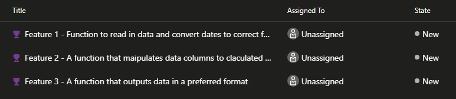
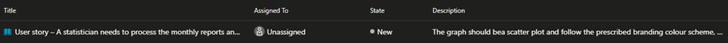

# Getting to know Azure DevOps

## Collections Page

Azure DevOps opens at the Collections Landing page. Each Collection you have
access to will appear on the left hand side of the screen.

Inside each collection is a Dashboard which gives access to the Projects within
that collection, displayed as project cards, your assigned work items and any
pull requests you have made or have been assigned to as a reviewer.

{fig-align="center"}

## Project page

::: img-float
{style="float: right; margin: 5px;"}
:::

When opening a project you will find a side bar with several options and tools.

For Most projects only the Overview panel, Boards and Repos tools will be
relevant, and they are explored in more details below.

The remaining three panels facilitate the continuous integration, continuous
delivery (CI/CD) software development. Therefore , they are of use for projects
that are releasing a software product that is continuously adding and improving
features, releasing patches, and new versions of the software. The `Pipelines`
panel is to facilitate production pipelines for software release, integrating
with the `Test Plans` panel to facilitate the CI/CD schedule. It allows for team
testers to collaborate with feature developers in a cohesive manner.

These panels are not to be confuse with Reproducible Analytical Pipelines and
within code testing of features. Instead they are used for production guidance
and external stress-testing of the software before deployment.

The `Artifacts` is a small internal repository aimed at storing small elements
of code - such as snippets, for use as an internal package repository for teams
working together. Due to the nature of Azure and how it communicates within the
Integrated Development Environments (IDEs), such as R studio, that are available
within the virtual machine architecture, the Artifacts tab cannot be untalised
to its full effect. However, it is a good place to make small coding notes for
colleagues to view.

### Overview

The `Overview` panel aims to provide quick access to top level information about
the project. This is where you can add a summary of the project, view team
members and the general activity within the project will be listed within the
Summary section.

### Boards

For project planning, team and task management, management of bug fixes and pull
requests.

#### *Work items*

Work items or tickets are used to break down required tasks within a project.
You can use these `tags` to highlight, assign and keep track of tasks, project
progress and current thinking to help with cooperation across the project.

The tags can be broken down into different categories:

***Bug*** - An error found within the code that causes it not to produce the
intended consequences. These can be as small as misspellings or not producing
outcomes to visual intentions to more severe consequences such as security risks
etc.. This tag can be sued to highlight known issues that are queued to be
fixed.

***Epic*** - Denotes a piece of work that is of *High Importance*. Usually, a
large-scale element of the project that gives a broad overview. An Epic work
item can be broken down into `Features` and `User stories.`

{fig-alt="A table showing Title: [Crown emoji] Create pipeline that reads in data and outputs specific file. Assigned to: Unassigned and State: New."}

This tag can be used to highlight the overarching steps on a process map or
goals that a developer team may have.

***Feature*** - describes the development of functional pieces of work. The
following example shows three Feature work items that may be part of the epic
tag above.

\

***Task*** - This tag can be used to break down any of the other tags into
actionable items. A to-do list of tasks can be created at the feature and Epic
levels to help break down and assign workload between colleagues.\

***Test Case*** - This is a step-by-step guide breaking down the testing of the
Project Features. This allows for the testers to continually check the
functionality of the code and how it preforms alongside the elements set out in
the *Epic* and User Story tags.\

***User Story*** - Describes the build from the perspective of the user and how
they would use and implement the code.  This helps you think about the end user
when developing the code, asking questions on how they would interact with the
code and its outcomes.

{width="733"}

### Repos

::: img-float
{style="float: right; margin: 5px;"}
:::

Within the Repos tab you can manage your code base, through tracking commits,
pushes and pull requests. It is the viewing portal for the remote repository of
the version control infrastructure.These features communicate with you
Integrated Development Environment (IDE), an example of which is R studio, where
the development and testing of the code will be done, via Git. Git is an open
source version control tool that allows you to maintain clear and backed up
versions of all coding projects. For more information on using Git within the R
environment, can be found on the page \[Using Git in R\]()

You can open and view all files pushed to your remote repository within the
files tab.

::: img-float
{style="float: left; margin: 5px;"
width="350"}
:::

You can also find links for cloning and/or forking the repository. For each file
you can view the contents of the file., in the Contents tab.

The History tab shows the history of changes made to the file, listing the
associated commit, the type of change and any associated pull requests. You can
directly access the compare tag for a specific commit from the history table or
from within the compare tab. You can select which commits you want to compare.
The changes can either be viewed side by side or in-line.

The final tab is the Blame tab. This highlights which bits of the code have been
edited,

::: callout-note
*Blame* is not a negative term within software development instead it records
and displays the author of specific lines in a file.
:::

For more information on Pull requests
